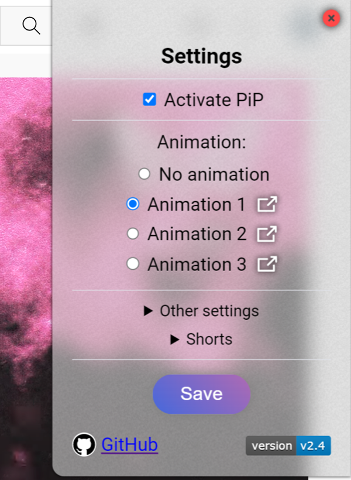
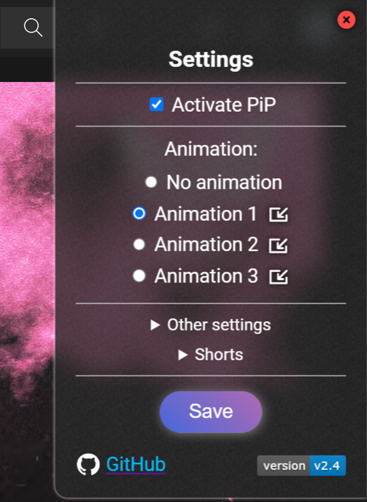
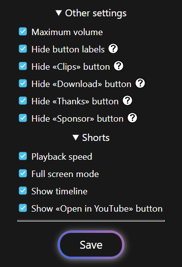
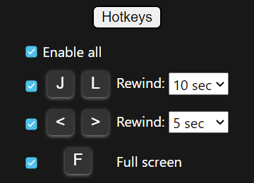
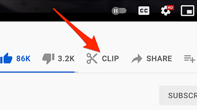

# Picture-in-Picture-for-Youtube


### Chrome extension

Activates the Picture-in-Picture button and other useful features.

❗ Attention! After changing the plugin settings, reload the YouTube page. ❗

</img>

## Animations:
<details>
  <summary></summary>
  
  Animation 1:</br>
  </br>
  Animation 2:</br>
  </br>
  Animation 3:</br>
  
</details>

## Overview:
<details>
  <summary></summary>
  <p align="center">
    
    
    </br>
     </br>
     
  </p>  
</details>


## How to Install:
### Chrome:
  1. Download latest **[Release](https://github.com/SuperZombi/Picture-in-Picture-for-Youtube/releases)**.
  2. Unpack the ```src``` folder to a convenient location.
  3. ```⋮``` > "Additional tools" > "Extensions".
  4. Turn on "Developer Mode".
  5. Press "Load unpacked extension".
  6. Select the path to the ```src``` folder.

### Tampermonkey:
1. Install **[Tampermonkey](https://www.tampermonkey.net/)**.
2. Install **[Script](https://raw.githubusercontent.com/SuperZombi/Picture-in-Picture-for-Youtube/main/pip.user.js)**.


## How to open Plugin menu:
<details>
  <summary></summary>
  
  ❗ Don't forget to click the `Save` button. ❗
  
  </br>
  
</details>


## List of changes:

#### 2.4.1:
 * Speedometer bug fixes

### 2.4:
 * Timeline and controls in Shorts.
 * Hotkeys for rewind and Fullscreen in Shorts.
  * <details><summary>Maximum volume.</summary>
    By default, YouTube makes sound audio normalization, and volume of the video actually turns out to be in the range from 0.75 to 0.85 (Even if the player is set to 100%)</details>
 * <details><summary>«Open in YouTube» in Shorts.</summary>
    Opens the current video in the standard YouTube player in a new tab.</details>
 * Redesigned settings engine. [dev]
 * Optimization, User Experience improvement and Bug fixes.
 * (Hold `ctrl` to reset extension settings)

<br/>
<details>
  <summary>Other</summary>

  ### 2.3:
  * Added a function to hide the <code>Download</code> button.
  * <details><summary>Added a function to hide labels for buttons.</summary></details>
  
  ### 2.2:
  * Added speed control for Shorts.
  * Added full screen mode for Shorts.
  
  ### 2.1:
  * Added a function to hide the <code>Thanks</code> button.
  * Added a function to hide the <code>Sponsor</code> button.
  
  #### 2.0.1:
  * Ukranian localization.

  ### 2.0:
  * Extension moved to manifest version 3.
  
  #### 1.6.1:
  * Bug fix.

  ### 1.6:
  * Russian localization.
  
  #### 1.5.1:
  * Hiding the Clips button is now more stable.

  ### 1.5:
  * <details><summary>Added a function to hide the <code>Create Clip</code> button.</summary></details>
  
  #### 1.4.1:
  * Added animation pause in settings, when `Change Pip Icon` is disabled.
  
  ### 1.4:
  * Added new animation.
  * Added hover animation.
  * Dark Theme in Settings.
  * Preview animations in Settings.
  
  ### 1.3:
  * The plugin is adapted for the new YouTube interface.
  * Added animation (enable it in the settings)

  ### 1.2:
  * Fixed a bug where the button did not appear. (Previously, it was necessary to reload the page)

  ### 1.1:
  * The button is hidden in full screen mode.
  * Changed the icon of the button during the active "Picture in Picture" mode.
  * Now you can make the choice to change the custom button or not.

  ### 1.0:
  * The "Picture in Picture" button is now displayed.
  * The button is changed to a custom one.
  
</details>

<hr>

#### <a href="https://www.donationalerts.com/r/super_zombi">Support the project</a> (But now it's better to email me and I'll send you the details)
