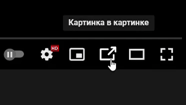
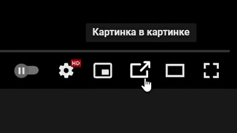
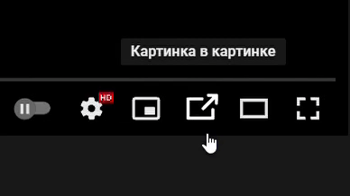
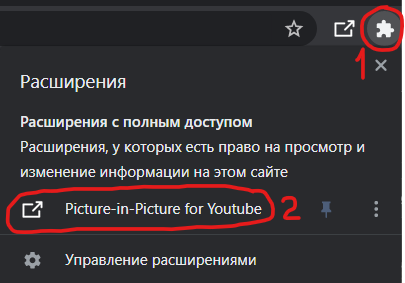

# Picture-in-Picture-for-Youtube
### Chrome extension

Add Picture-in-Picture button active

Version: <code>1.4.1</code>

❗ Attention! After changing the plugin settings, reload the YouTube page. ❗

</img>

## Animations:
<details>
  <summary></summary>
  
  Animation 1:</br>
  </br>
  Animation 2:</br>
  </br>
  Animation 3:</br>
  
</details>

</br>


## How to Install:
1. Code > "Download Zip".
2. Unpack the ```src``` folder to a convenient location.
3. "Additional tools" > "Extensions".
4. Turn on "Developer Mode".
5. Press "Load unpacked extension".
6. Select the path to the ```src``` folder.

</br>

## How to open Plugin menu:
<details>
  <summary></summary>
  
  </br>
  
</details>

</br>

## List of changes:

### 1.4:
* Added new animation.
* Added hover animation.
* Dark Theme in Settings.
* Preview animations in Settings.

#### 1.4.1:
* Added animation pause in settings, when "Change Pip Icon" is disabled.

<details>
  <summary>Other</summary>
  
  ### 1.3:
  * The plugin is adapted for the new YouTube interface.
  * Added animation (enable it in the settings)

  ### 1.2:
  * Fixed a bug where the button did not appear. (Previously, it was necessary to reload the page)

  ### 1.1:
  * The button is hidden in full screen mode.
  * Changed the icon of the button during the active "Picture in Picture" mode.
  * Now you can make the choice to change the custom button or not.

  ### 1.0:
  * The "Picture in Picture" button is now displayed.
  * The button is changed to a custom one.
  
</details>

<hr>

#### <a href="https://www.donationalerts.com/r/super_zombi">Support the project</a>
